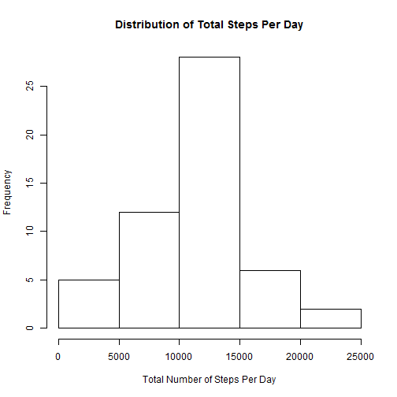
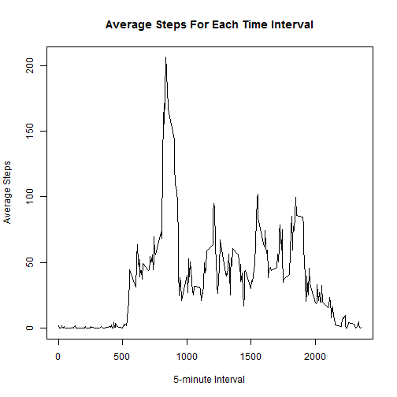
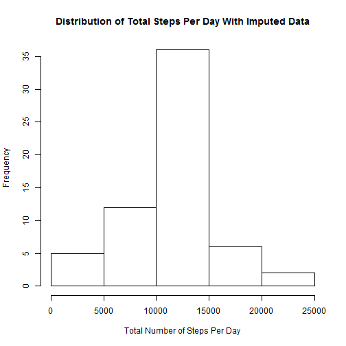
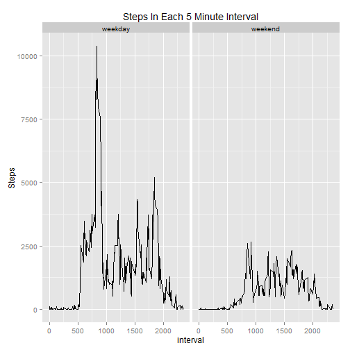

## Assumptions 

The input file used in the assignment, activity.csv, is already downloaded and located in the working directory.

The specify_decimal function is used to set the number of decimal places for some of the calculation described in this document.


```r
specify_decimal <- function(x, k) {
    format(round(x, k), nsmall=k)
}
```


Weekend is defined as Saturday and Sunday, other days are considered Weekday.

## Prerequisites

This solution requires ggplot2 library.


## Loading and preprocessing the data

The file is loaded using read.csv command, and date column is formatted as Date.


```r
rawData <- read.csv('activity.csv')

rawData$date <- as.Date(rawData$date, '%Y-%m-%d')
```


## What is mean total number of steps taken per day?


For the first part of the question, the data for the histogram is generated by aggregating the input data by date, and taking the sum of the steps for each date. Mean and Median of the total steps are calculated by using mean and median functions, respectively, using the option to remove NA values. The histogram is then generated by using base plotting system in R.


```r
histogramData <- aggregate(rawData$steps, by=list(date=rawData$date), FUN=sum)

hist(histogramData$x, main = "Distribution of Total Steps Per Day", xlab = "Total Number of Steps Per Day", ylab = "Frequency")
```

 

```r
dataMean <- specify_decimal(mean(histogramData$x, na.rm = TRUE), 4)
dataMedian <- median(histogramData$x, na.rm = TRUE)
```


The mean total number of steps is 10766.1887 and median total number of steps is 10765.


## What is the average daily activity pattern?


The next question is about average daily activity pattern. The average activity pattern for each time interval is calculated by using aggregate function, taking the average of each 5-minute interval across all days and removing na values.


```r
averageDailyPatternData <- aggregate(rawData$steps, by=list(interval=rawData$interval), FUN=mean, na.rm = TRUE)

plot(x ~ interval, averageDailyPatternData, type="l", main = "Average Steps For Each Time Interval", xlab = "5-minute Interval", ylab = "Average Steps")
```

 

```r
intervalWithHighestAverageSteps <- averageDailyPatternData[averageDailyPatternData$x == max(averageDailyPatternData$x),1]
```


The maximum observed average steps for each 5-minute interval happens at interval 835.


## Imputing missing values


```r
numberOfNaValues <- sum(is.na(rawData$steps))
```


There are 2304 observations that contain invalid values.


In this solution, the NA values for an interval will be replaced with the average value for said interval that is already calculated in previous section. The histogram, mean, and median are then recalculated using the dataset with imputed values.


```r
imputedData <- rawData

for(i in 1:dim(imputedData)[1]) {
    if (is.na(imputedData[i,1])){
        imputedData[i,1] <- averageDailyPatternData[averageDailyPatternData$interval == imputedData[i,3],2]   
    }
}

imputedHistogramData <- aggregate(imputedData$steps, by=list(date=imputedData$date), FUN=sum)

hist(imputedHistogramData$x, main = "Distribution of Total Steps Per Day With Imputed Data", xlab = "Total Number of Steps Per Day", ylab = "Frequency")
```

 

```r
imputedDataMean <- specify_decimal(mean(imputedHistogramData$x, na.rm = TRUE), 4)
imputedDataMedian <- specify_decimal(median(imputedHistogramData$x, na.rm = TRUE), 4)
```


After imputing, the mean total number of steps is now 10766.1887 and median of total number of steps is now 10766.1887


## Are there differences in activity patterns between weekdays and weekends?


In order to determine if a given day is weekend or weekday, first the day of the week of each date are generated for each observation in the data set using weekdays function.


```r
days <- weekdays(imputedData$date)
```

Thereafter the weekday/weekend factor is generated by the following function.


```r
isWeekendOrWeekday <- function(x) { if (x == "Saturday" || x == "Sunday") "weekend" else "weekday" }

weekendFactors <- as.factor(unlist(lapply(days, isWeekendOrWeekday)))
```

The resulting factors are then added to the dataset with cbind.


```r
imputedData <- cbind(imputedData, weekendFactors)

comparisonData <- aggregate(imputedData$steps, by=list(interval=imputedData$interval,type=imputedData$weekendFactors), FUN = sum)
```

After getting the comparison data, the charts are then generated using ggplot2.


```r
library(ggplot2)

g <- ggplot(comparisonData, aes(interval, x))
p <- g + geom_line() + facet_grid( . ~ type) + ylab("Steps") + ggtitle("Steps In Each 5 Minute Interval")
print(p)
```

 

